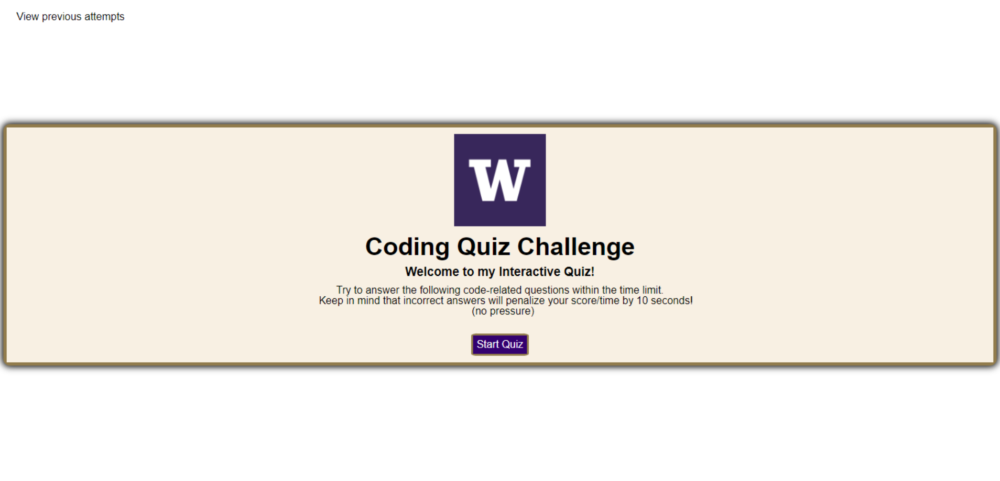
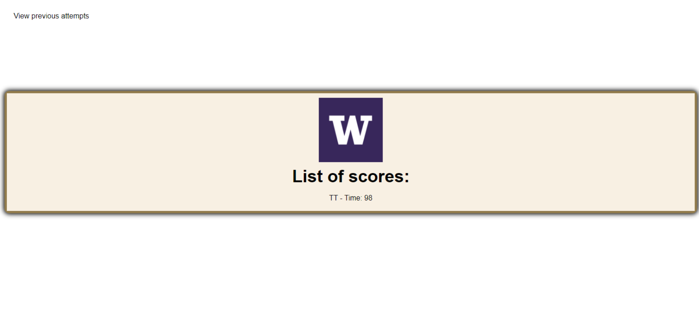

# ChallengeModule04 - Code Quiz

Description

The purpose of this week's Challenge was to build a timed multiple choice coding quiz about Javascript using HTML, CSS, Javascript while incorporating the recently learned Web API material.

Screenshot

Link to Deployed Webpage

https://tonytran97.github.io/ChallengeModule04/
